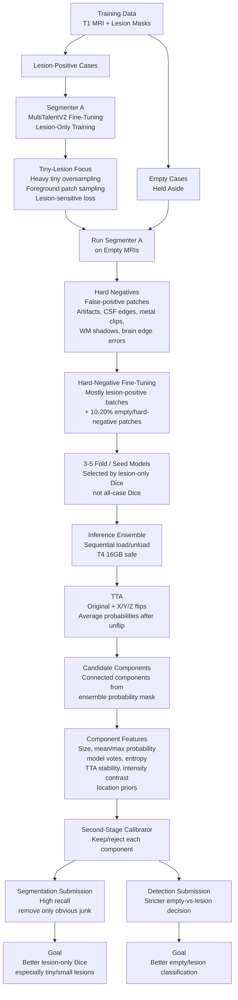

# Step 1 — build model tarball (run once, ~30 seconds)
bash build_model_tarball.sh \
  --checkpoint /data/data/DA25S005/miccai_tbi/MultiTalentV2_finetuning/checkpoints/trained_models/best_tr_f1_kpcyjb66.pt \
  --plans /data/data/DA25S005/miccai_tbi/MultiTalentV2_finetuning/MultiTalentV2_pretrained/Dataset617_nativect/MultiTalent_trainer_4000ep__nnUNetResEncUNetL1x1x1_Plans_znorm_bs24__3d_fullres/fold_all/nnUNetResEncUNetL1x1x1_Plans_znorm_bs24.json

# Step 2 — convert a test scan to .mha (one-liner)
python3 -c "
import SimpleITK as sitk
img = sitk.ReadImage('/data/data/DA25S005/miccai_tbi/MultiTalentV2_finetuning/MICCAI_AIMS_TBI/scan_0001_T1.nii.gz')
sitk.WriteImage(img, 'test/input/images/t1-brain-mri/T1w.mha')
print('Converted OK')
"

# Step 3 — extract model for local test
mkdir -p test/model && tar -xzvf algorithmmodel.tar.gz -C test/model/

# Step 4 — build Docker image (~5-10 min first time)
bash save.sh

# Step 5 — run local test
bash test_run.sh

python3 inference_sweep.py   --config config.yml   --fold 1   --split val   --positive-only   --load-mode preload   --checkpoints     checkpoints/trained_models/best_tr_f1_kpcyjb66.pt     checkpoints/tbi_multitalentv2/segmenter_a/fold_1/best_tiny.pt     checkpoints/tbi_multitalentv2/segmenter_a/fold_1/best_gt50.pt checkpoints/trained_models/best_714109.pt  --thresholds 0.10 0.15 0.20 0.25   --min-components 0 3 5   --output-dir checkpoints/tbi_multitalentv2/inference_sweeps/fast_ensemble_f1