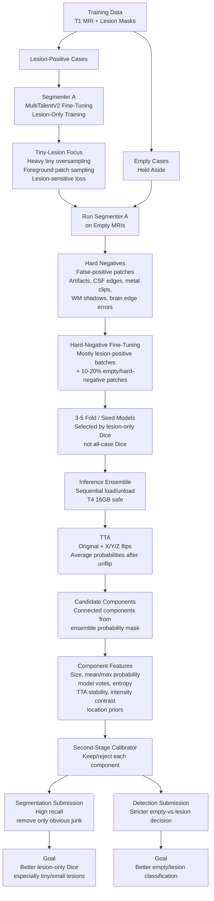

# Step 1 — build model tarball (run once, ~30 seconds)
bash build_model_tarball.sh \
  --checkpoint /data/data/DA25S005/miccai_tbi/MultiTalentV2_finetuning/checkpoints/trained_models/best_tr_f1_kpcyjb66.pt \
  --plans /data/data/DA25S005/miccai_tbi/MultiTalentV2_finetuning/MultiTalentV2_pretrained/Dataset617_nativect/MultiTalent_trainer_4000ep__nnUNetResEncUNetL1x1x1_Plans_znorm_bs24__3d_fullres/fold_all/nnUNetResEncUNetL1x1x1_Plans_znorm_bs24.json

# Step 2 — convert a test scan to .mha (one-liner)
python3 -c "
import SimpleITK as sitk
img = sitk.ReadImage('/data/data/DA25S005/miccai_tbi/MultiTalentV2_finetuning/MICCAI_AIMS_TBI/scan_0001_T1.nii.gz')
sitk.WriteImage(img, 'test/input/images/t1-brain-mri/T1w.mha')
print('Converted OK')
"

# Step 3 — extract model for local test
mkdir -p test/model && tar -xzvf algorithmmodel.tar.gz -C test/model/

# Step 4 — build Docker image (~5-10 min first time)
bash save.sh

# Step 5 — run local test
bash test_run.sh

## Phase G — hard-negative fine-tuning

Mine false-positive patches on empty training MRIs:

```bash
python3 mine_hard_negatives.py \
  --config config.yml \
  --fold 1 \
  --split train \
  --load-mode preload \
  --checkpoints \
    checkpoints/trained_models/best_tr_f1_kpcyjb66.pt \
    checkpoints/tbi_multitalentv2/segmenter_a/fold_1/best_gt50.pt \
    checkpoints/tbi_multitalentv2/segmenter_a/fold_1/best_tiny.pt \
    checkpoints/trained_models/best_714109.pt \
  --threshold 0.10 \
  --min-component-voxels 3 \
  --max-components-per-case 8 \
  --output-csv checkpoints/tbi_multitalentv2/hard_negatives/fold_1/train_empty_fp_components.csv
```

Fine-tune with lesion-positive cases plus mined empty hard negatives:

```bash
python3 train_segmenter_a.py \
  --config config.yml \
  --fold 1 \
  --init-checkpoint checkpoints/tbi_multitalentv2/segmenter_a/fold_1/best_gt50.pt \
  --output-subdir segmenter_a_hardneg \
  --include-empty-fraction 0.15 \
  --hard-negative-manifest checkpoints/tbi_multitalentv2/hard_negatives/fold_1/train_empty_fp_components.csv \
  --hard-negative-center-prob 0.85 \
  --hard-negative-max-centers-per-case 8 \
  --probability-threshold 0.10 \
  --full-lr 0.00001 \
  --epochs 30 \
  --wandb-name segmenter-a-hardneg-f1
```

Then sweep the new candidate before changing Docker submission:

```bash
python3 inference_sweep.py \
  --config config.yml \
  --fold 1 \
  --split val \
  --positive-only \
  --load-mode preload \
  --checkpoints \
    checkpoints/trained_models/best_tr_f1_kpcyjb66.pt \
    checkpoints/tbi_multitalentv2/segmenter_a/fold_1/best_gt50.pt \
    checkpoints/tbi_multitalentv2/segmenter_a/fold_1/best_tiny.pt \
    checkpoints/tbi_multitalentv2/segmenter_a_hardneg/fold_1/best_gt50.pt \
    checkpoints/trained_models/best_714109.pt \
  --thresholds 0.10 0.15 0.20 \
  --min-components 0 3 5 \
  --tta none \
  --output-dir checkpoints/tbi_multitalentv2/inference_sweeps/hardneg_f1
```

## Phase H — component calibrator

Train a component-level false-positive rejector on fold-1 training cases. This uses the
current 4-model ensemble at a low candidate threshold, labels each predicted blob by
ground-truth overlap, and fits a high-recall random-forest calibrator.

```bash
python3 train_component_calibrator.py \
  --config config.yml \
  --fold 1 \
  --split train \
  --load-mode preload \
  --checkpoints \
    checkpoints/trained_models/best_tr_f1_kpcyjb66.pt \
    checkpoints/trained_models/best_gt50.pt \
    checkpoints/trained_models/best_tiny.pt \
    checkpoints/trained_models/best_714109.pt \
  --candidate-threshold 0.10 \
  --min-candidate-voxels 1 \
  --min-true-overlap-voxels 1 \
  --positive-weight 8 \
  --n-estimators 500 \
  --tta flips \
  --output-dir checkpoints/tbi_multitalentv2/component_calibrator/fold_1
```

Sweep calibrator thresholds on full validation:

```bash
python3 component_calibrator_sweep.py \
  --config config.yml \
  --fold 1 \
  --split val \
  --load-mode preload \
  --checkpoints \
    checkpoints/trained_models/best_tr_f1_kpcyjb66.pt \
    checkpoints/trained_models/best_gt50.pt \
    checkpoints/trained_models/best_tiny.pt \
    checkpoints/trained_models/best_714109.pt \
  --calibrator checkpoints/tbi_multitalentv2/component_calibrator/fold_1/component_calibrator.joblib \
  --candidate-threshold 0.10 \
  --calibrator-thresholds 0.02 0.05 0.10 0.15 0.20 0.30 0.50 \
  --min-components 0 5 10 20 \
  --tta flips \
  --output-dir checkpoints/tbi_multitalentv2/component_calibrator_sweeps/fold_1
```

Decision rule: keep the calibrator only if positive Dice stays near the 4-model
baseline while empty false positives drop clearly.




python3 inference_sweep.py   --config config.yml   --fold 1   --split val   --positive-only   --load-mode preload   --checkpoints     checkpoints/trained_models/best_tr_f1_kpcyjb66.pt     checkpoints/tbi_multitalentv2/segmenter_a/fold_1/best_tiny.pt     checkpoints/tbi_multitalentv2/segmenter_a/fold_1/best_gt50.pt checkpoints/trained_models/best_714109.pt  --thresholds 0.10 0.15 0.20 0.25   --min-components 0 3 5   --output-dir checkpoints/tbi_multitalentv2/inference_sweeps/fast_ensemble_f1